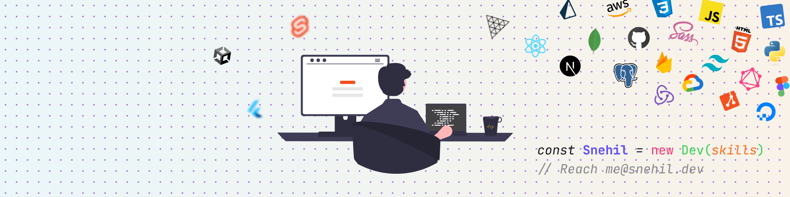

  
  
   
   
  
  
  
  

 

## About Me 🙋🏽‍♂️
<!-- - 🔭 I’m currently working on ... -->
<!-- - 👯 Open for hackathons -->
<!-- - 🤔 I’m looking for help with ... -->
- 🌱 I’m currently learning Golang.
- 💬 Ask me about TypeScript, React, Design, and CSS.
- ⚡ Fun fact: I love playing couch multiplayer games :3
- 📫 Reach [me@snehil.dev](mailto:me@snehil.dev)
- 😄 Pronouns: He/Him

 

 

<table>
  <tr>
    <td>
      </td>
    <td>
      </td>
  </tr>
</table>

